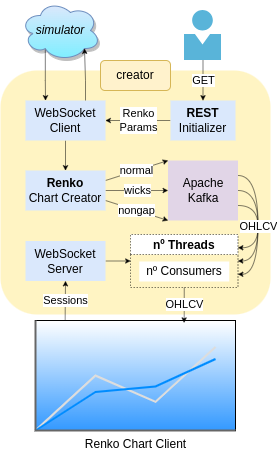

# renko-quarkus

A simple Websocket Server/Client template that converts Tick Data into OHLCV Renko via Websockets!

## Overview


<details>
<summary>In-depth overview</summary> <br>

Everything starts with a GET request, which the user enters the renko parameters into the url:
```text
localhost:9000/client/{symbol}/{brickSize}
```
The WebSocketClient will open a connection to simulator server, while the symbol and brickSize are stored in SessionService

Every message came from simulator will be transfered to  reactive RenkoChartService, send to **3 producers** (`normal-in-memory`, `wicks-in-memory`, `nongap-in-memory`) a **dynamic topic** with the following pattern:
```text
new renko: {symbol}_{mode}
forming renko: {symbol}_{mode}_forming

ex: us30_normal, eurgbp_wicks, us500_nongap
```
> **_NOTE:_**  The forming renko topics are not actually sent because **a suitable frontend hasn't been created yet**. <br>
Maybe in the future using Server-Sent-Events (SSE).

The WebsocketServer will receive a connection following the pattern:
```text
ws://localhost:9000/renko/{symbol}/{mode}
```
The symbol must be the same as that given in the GET request, otherwise the consumer will read an empty non-existent topic.


We have 2 _"types"_ of consumers:
- **_3 Static consumers_**: Once time inicialized, will never be closed until the application shutdown.
- **_nº Dynamic consumers_**: Created as needed, can be closed due inactivity a.k.a empty sessions, every 30min.

The Group ID of each consumer are identify by renko mode _[`normal`, `wicks`, `nongap`]_ which reads the respective channel/topic.

**Both consumers** will have the **topic updated** if they have **empty sessions** and a new connection with the **same Group ID** (renko mode) is made. <br>

_Example:_
```text
Consumer nongap-0, topic us30_nongap, total sessions: 1
*session disconnect*
Consumer nongap-0, topic us30_nongap, total sessions: 0
*new connection to us500_nongap*
Using an existing empty session consumer of group nongap to topic us500_nongap
*change the topic*
Consumer nongap-0, topic us500_nongap, total sessions: 1
```
</details>

## <a name="usage"></a>Usage
The application can be run in:
- [Dev mode](#dev-mode)
- [Packaged running locally (or Docker)](#locally)
- [Native executable running locally (or Docker)](#native)

After choose your prefered way, and once time that all things are on: <br>

1º: Connect multiples websocket clients with the proper chart logic to renko server _(see python folder)_:
- ws://127.0.0.1:9000/renko/US30/`{mode}`
- ws://127.0.0.1:9000/renko/EURGBP/`{mode}` <br>
`{mode}` can be `normal`, `wicks` or `nongap`

2º: a GET requisition from browser by acessing the following urls:
- http://localhost:9000/client/US30/5
- http://localhost:9000/client/EURGBP/0.0003

<details>
<summary>Dev mode</summary>

### <a name="dev-mode"></a>Dev mode
In root path: <br>
1º Start simulator.
```shell script
./mvnw -f simulator compile quarkus:dev
```
2º Start creator.
```shell script
./mvnw -f creator compile quarkus:dev
```
Thanks to [Quarkus Dev Services](https://quarkus.io/guides/kafka-dev-services), a Kafka broker is started automatically from a container.
</details>

<details>
<summary>Packaged running locally (or Docker)</summary>

### <a name="locally"></a>Packaged running locally
In root path: <br>
1º package simulator and creator.
```shell script
./mvnw -f simulator package
./mvnw -f creator package
```
> **_NOTE:_** Before packaging **creator**, you'll need to change 2 properties in application.properties to:<br>
_**%prod.kafka.bootstrap.servers**=localhost:9092_
_**%prod.creator.client.simulator.url**=localhost:8080/ticks._ <br>
If running on Docker, no changes are needed.

2º We need start a Kafka broker manually by ourselves, so using Docker, let's iniciate the kafka-compose.yaml:
```shell script
docker compose -f kafka-compose.yaml up -d
```
3º Run the packages!
```shell script
java -jar simulator/target/quarkus-app/quarkus-run.jar
java -jar creator/target/quarkus-app/quarkus-run.jar
```
#### on Docker
Afte 1º just do:
```shell script
docker compose up -d
```
</details>

<details>
<summary>Native executable running locally (or Docker)</summary>

### <a name="native"></a>Native executable running locally (or Docker)
1º package simulator and creator.
```shell script
./mvnw -f simulator package -Dnative -Dquarkus.native.container-build=true
./mvnw -f creator package -Dnative -Dquarkus.native.container-build=true
```
> **_NOTE:_** Before packaging **creator**, you'll need to change 2 properties in application.properties to:<br>
_**%prod.kafka.bootstrap.servers**=localhost:9092_
_**%prod.creator.client.simulator.url**=localhost:8080/ticks._ <br>
If running on Docker, no changes are needed.

2º We need start a Kafka broker manually by ourselves, so using Docker, let's iniciate the kafka-compose.yaml:
```shell script
docker compose -f kafka-compose.yaml up -d
```
3º Run the packages!
```shell script
./simulator/target/simulator-0.0.1-runner
./creator/target/creator-0.0.1-runner
```
#### on Docker
Afte 1º just do:
```shell script
docker compose -f native-compose.yaml up -d
```
</details>